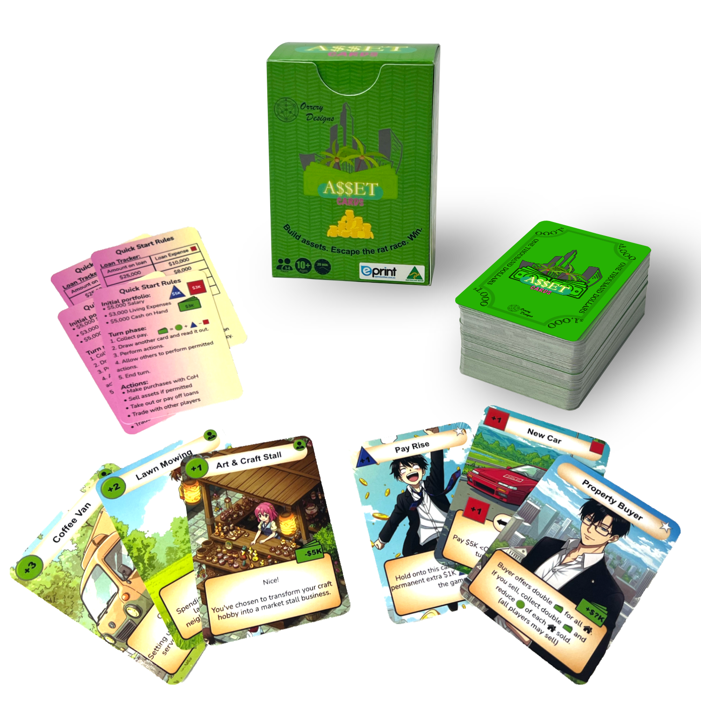


Buy Now!


---

---

## ASSET Cards

a fast-paced, pocket-sized card game that sneakily teaches you how to escape the paycheck-to-paycheck trap. Appropriate for ages 10+ and solo-playable or with up to four players.

    

    

    
     <b>Simple</b>

    Easy to learn, with numerous hidden financial lessons to discover.
    

    

    

    
     <b>Fast</b>

    Light weight, quick to set up, and exciting gameplay.
    

    <a href="https://instagram.com/assetcards" class="tile-link">
    

    

    
     <b>Social</b>

    Starts the money talk!
     Follow us on Instagram for more!
    
</a>

---


Buy Now!
