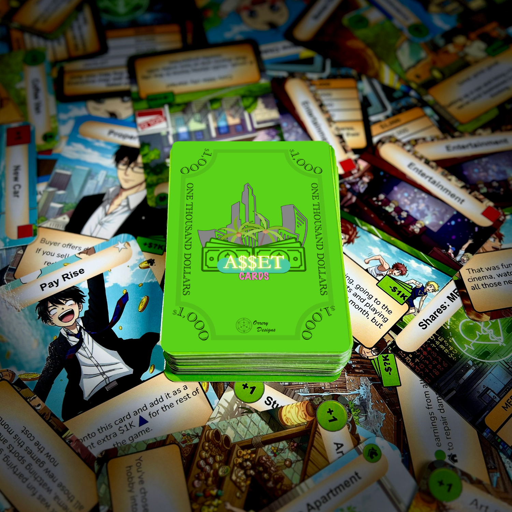

## Stack Your Future.

ASSET Cards is a fast-paced financial literacy card game that teaches real-world money skills through play.

Build assets, manage expenses, avoid debt traps, and grow your passive income as you race toward financial freedom. Designed for ages 10+, ASSET Cards transforms complex financial concepts into a fun, competitive, and easy-to-learn experience.

Whether you're playing with family, friends, students, or clients, every round delivers strategy, laughs, and valuable money lessons that stick.


Buy Now! 


---

## What You'll Learn

- The difference between **assets** and **liabilities**
- How **passive income** works
- Smart money management habits
- Risk vs reward decision-making
- Budgeting and financial strategy
- The basics of investing and wealth building

---

## How It Works

Each turn, players:
1. Collect income
2. Draw a card
3. Make financial decisions

Buy assets, invest in opportunities, pay off loans, or survive unexpected expenses. The goal is simple:

> Build enough passive income to outpace your expenses and achieve financial freedom.

Easy to learn. Hard to put down.

---

## What's Included

- Full ASSET Cards deck (106 dual-function playing cards & 4 player reference cards)
- Rule sheet
- Fast-paced gameplay for 1–4 players
- Average 20-minute playtime

---

## Perfect For

- Families
- Students
- Teachers & classrooms
- Counsellors & youth programs
- Financial literacy workshops
- Game nights with purpose

---

## Australian Made

ASSET Cards was proudly designed, tested, and manufactured in Australia using Australian-owned businesses.

---

## Why ASSET Cards?

Most people are never taught how money actually works.

ASSET Cards was created to make financial literacy simple, social, and engaging — helping players build confidence with money in a way that feels more like game night than homework.

One deck. Endless "aha!" moments.

---

## Ready to Play?


Buy Now! 


